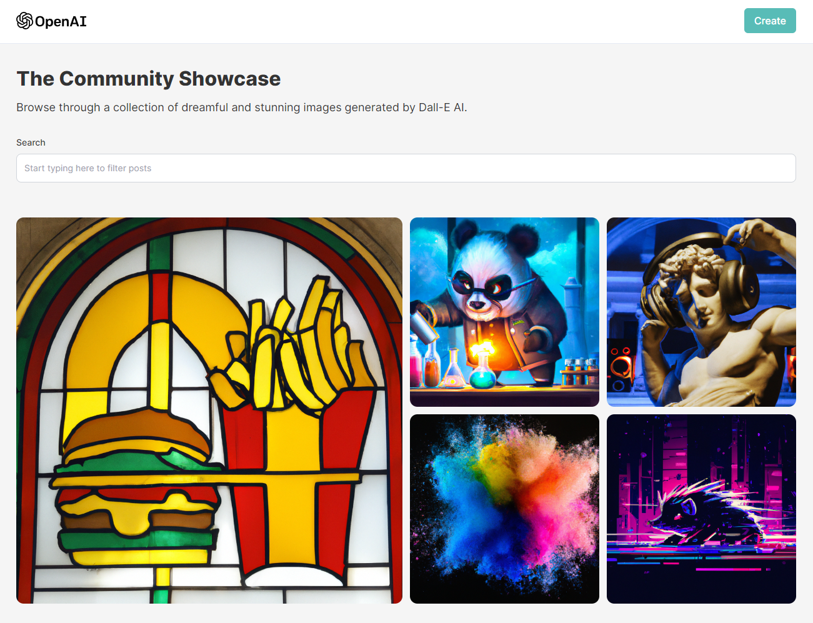

# Dall-E 2 Clone - MERN Stack

**Build with React.js and Tailwind for the frontend and Node.js with Express.js and MongoDB for the backend, storing images with Cloudinary**

- Generate images from text with OpenAI's Dall-E 2 API and store them in a database



## How to run

- Clone the repo
- Register and get API credentials from [OpenAI](https://openai.com/), [MongoDB](https://www.mongodb.com/) and [Cloudinary](https://cloudinary.com/)
- Create .env file in server folder and add the following variables

```js
MONGODB_URL = "mongodb+srv://...";
OPENAI_API_KEY = "xxxxx";
CLOUDINARY_CLOUD_NAME = "xxxxx";
CLOUDINARY_API_KEY = "xxxxx";
CLOUDINARY_API_SECRET = "xxxxx";
```

- Start generating images
